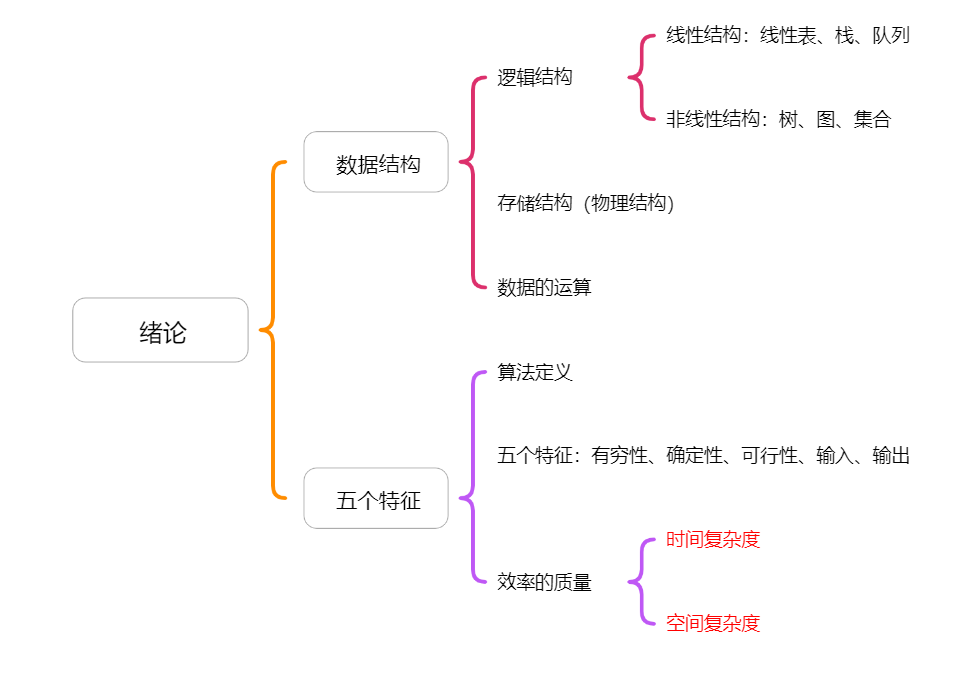

# 知识框架

# 数据结构的基本概念

## 基本概念和术语

### 数据

> [!TIP]
>
> 数据是信息的载体，是描述客观事物属性的数、字符及所有能输入到计算机中并被计算机程序识别和处理的符号的集合。数据是计算机程序加工的原料。

### 数据元素

> [!TIP]
>
> 

## 数据结构三要素

## 题目

# 算法和算法评价

## 算法的基本概念

## 算法效率的度量

## 题目
